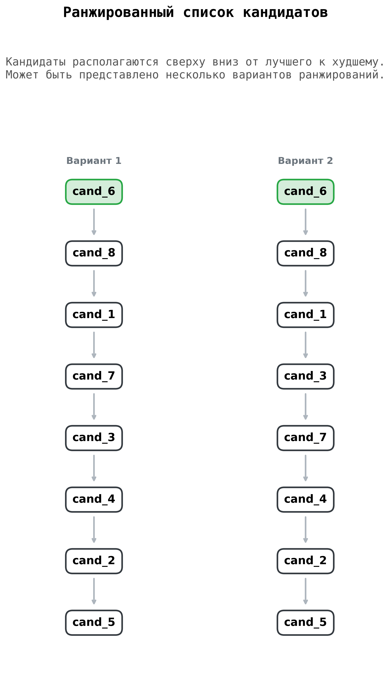

# Система с CLI для получения ранжированного списка кандидатов
Выпускная квалификационная работа бакалавра СПбГЭТУ «ЛЭТИ» по теме "Методы кодирования и нахождения размерности упорядоченных множеств".

Целью данной работы является разработка алгоритма для решения многокритериальных задач и его программная реализация на языке Python. 

В качестве практической задачи, для исследования и тестирования разработанного метода, выбрано получение ранжированного списка кандидатов на основе их резюме.

Важно заметить, что в качестве входных данных используются матрицы (таблицы), содержащие оценки кандидатов по нескольким критериям. 
Обработка текстовых резюме (в pdf или docx форматах) и их преобразование в таблицы в данной работе не предусмотрено и выходит за рамки рассматриваемой темы.

### Установка проекта:

1. Склонируйте репозиторий с помощью `git clone` или, находясь в main ветке, скачайте проект архивом через `Code → Download ZIP`.
2. Создайте виртуальное окружение в проекте: 
   ```bash
   # Для Windows
   python -m venv venv
   
   # Для Linux и macOS
   python3 -m venv venv
3. Активируйте созданное виртуальное окружение:
   ```bash
   # Для Windows
   venv\Scripts\activate
   
   # Для Linux и macOS
   source venv/bin/activate 
   
4. Скачайте зависимости:
   ```bash
   pip install -r requirements.txt
   
5. Запустите проект:
   ```bash
    # Для Windows
    python main.py
    
    # Для Linux и macOS
    python3 main.py

### Работа с программой:

После запуска программы высветится текст, кратко описывающий функционал:

```
Эта программа предназначена для получения ранжированного списка кандидатов.
Каждый кандидат оценивается по нескольким критериям c1,...,cn.
Примеры файлов с данными о кандидатах можно найти в папке data/
```
Также будет выведено сообщение с предложением ввести номер файла с данными:

```
Введите номер файла с данными о кандидатах
(доступные файлы можно посмотреть в папке data/).
Для выхода просто нажмите Enter!
```
Номер файла - это цифры после слова candidates в названии файла.

Если номер файла введен верно, то будет показано сообщение: 

```
Ранжированный список кандидатов успешно сохранен в файл: result/ranking.png
```

### Пример результата программы:

<p align="center">
<kbd></kbd>
</p>
